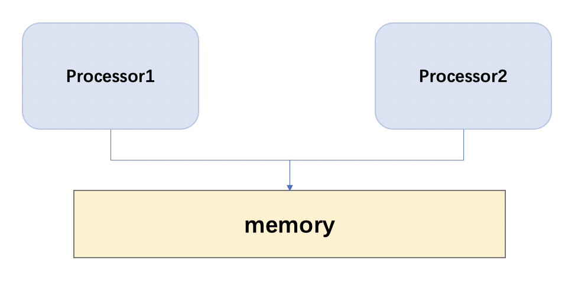
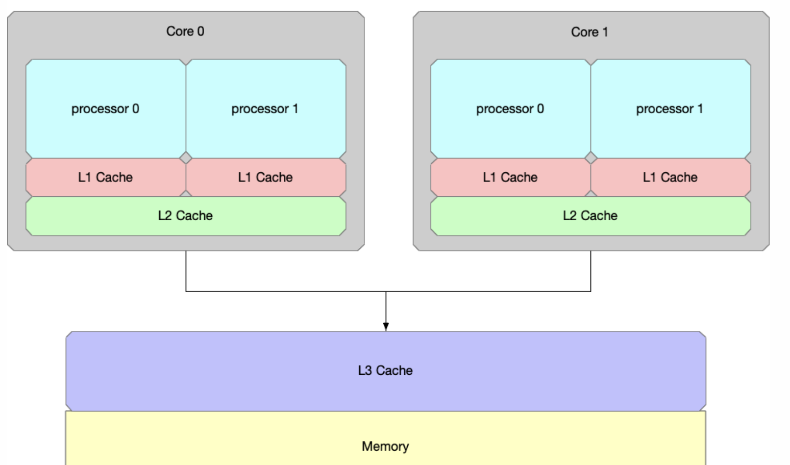
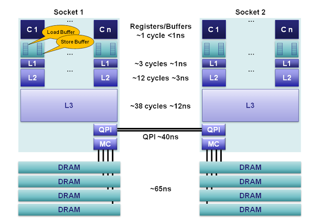
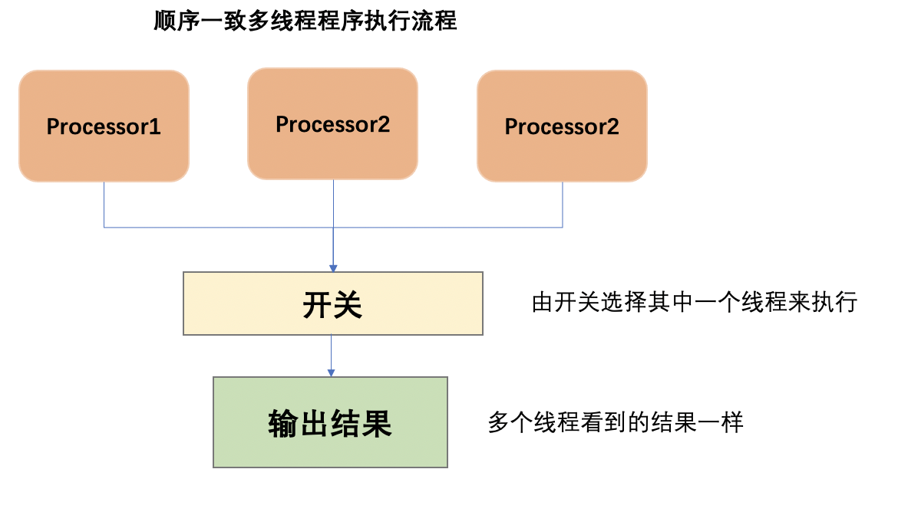
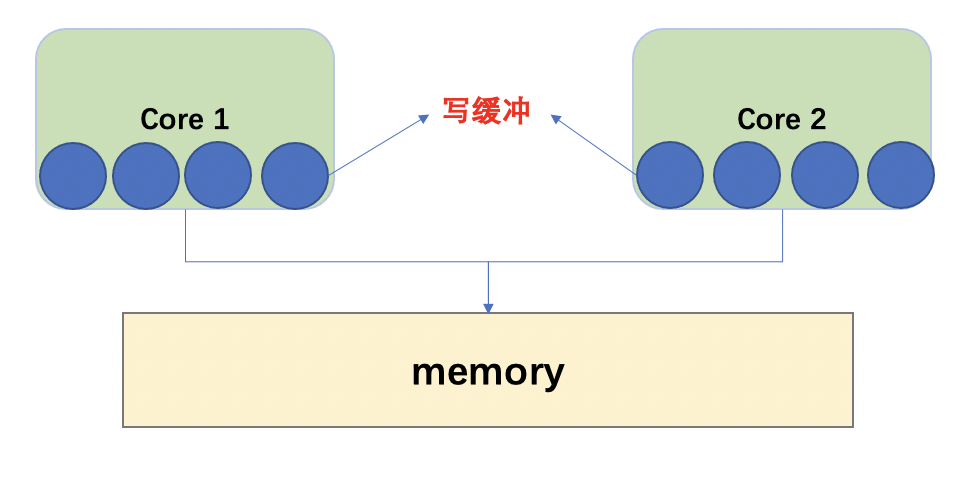
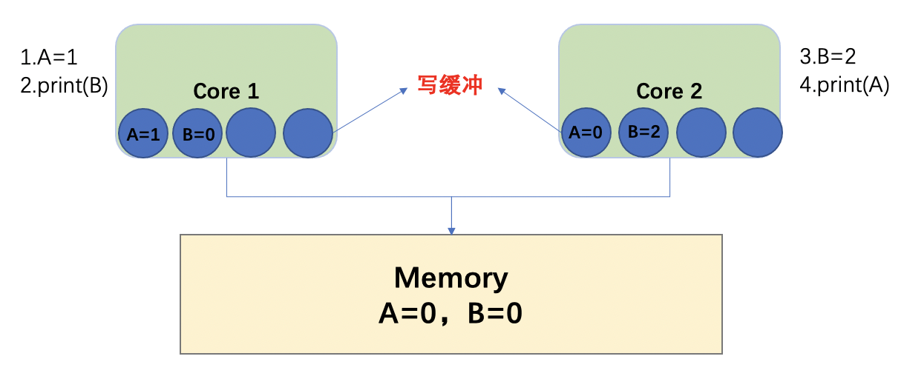
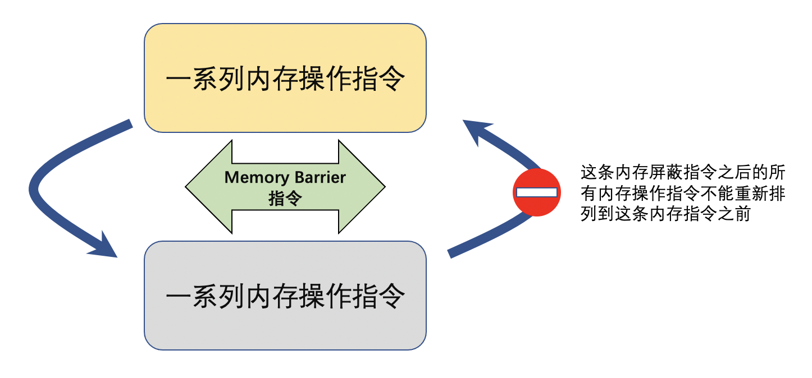

# C++ 内存

### 1. C++内存模型

> C++11 在**标准库**中引入了**memory model**，这应该是C++11最重要的特性之一了。C++11引入memory model的意义在于我们可以在high level language层面实现对在多处理器中多线程共享内存交互的控制。我们可以在语言层面忽略compiler，CPU arch的不同对多线程编程的影响了。我们的多线程可以**跨平台**。

**1）存储区域**

1. ###### 堆 heap ：
   
由malloc分配的内存块，其释放编译器不去管，由我们程序自己控制（一个malloc对应一个free）。如果程序员没有释放掉，在程序结束时OS会自动回收。涉及的问题：“缓冲区溢出”、“内存泄露”
   
2. ###### 自由存储区（free store）：
   
由new分配的内存块，其释放编译器不去管，由我们程序自己控制（一个new对应一个delete）。如果程序员没有释放掉，在程序结束时OS会自动回收。涉及的问题：“缓冲区溢出”、“内存泄露”
   
3. ###### 栈 stack ：
   
   是那些编译器在需要时分配，在不需要时自动清除的存储区。存放局部变量、函数参数。
存放在栈中的数据只在当前函数及下一层函数中有效，一旦函数返回了，这些数据也就自动释放了。
   
4. ###### 全局/静态存储区 （.bss段和.data段）：
   
全局和静态变量被分配到同一块内存中。在C语言中，未初始化的放在.bss段中，初始化的放在.data段中；在C++里则不区分了。
   
5. ###### 常量存储区 （.rodata段）：
   
存放常量，不允许修改（通过非正当手段也可以修改）
   
6. ###### 代码区 （.text段）：
   
存放代码（如函数），不允许修改（类似常量存储区），但可以执行（不同于常量存储区）
   
   

**2）C/C++ 分区**

- C分为四个区：堆，栈，静态全局变量区，常量区
- C++分为五个区：堆，栈，静态全局变量去，常量区，自由存储区。
- 根据c/c++对象生命周期不同，c/c++的内存模型有三种不同的内存区域，即`自由存储区`，`动态区`、`静态区`。
  **自由存储区**：局部非静态变量的存储区域，即平常所说的栈
  **动态区**： 用operator new ，malloc分配的内存，即平常所说的堆
  **静态区**：全局变量 静态变量 字符串常量存在位置
  而代码虽然占内存，但不属于c/c++内存模型的一部分

**3）Linux中程序的内存分布**

- `.text` 部分是编译后程序的主体，也就是程序的机器指令。
- `.data` 和 `.bss` 保存了程序的全局变量，`.data`保存有初始化的全局变量，`.bss`保存只有声明没有初始化的全局变量。
- `heap`（堆）中保存程序中动态分配的内存，比如C的malloc申请的内存，或者C++中new申请的内存。堆向高地址方向增长。
- `stack`（栈）用来进行函数调用，保存函数参数，临时变量，返回地址等

------

## 2.  CPU 架构演进

- ###### 早期CPU：CPU之间能进行共享访问的只有内存(无缓存CPU)

- ###### 多核CPU

  - 有多个CPU处理器，每个CPU处理器内部又有多个核心。
  - 存在只能被一个CPU核心访问的`L1 cache`。
  - 存在只能被一个CPU处理器的多个核心访问的`L2 cache`
  - 存在能被所有CPU处理器都能访问到的`L3 cache`以及`内存`。
  - `L1 cache`、`L2 cache`、`L3 cache`的容量空间依次变大，但是访问速度依次变慢。

>  Tips:  当CPU结构发生变化，增加了只能由内部才能访问的缓存之后，一些在旧架构上不会出现的问题，在新的架构上就会出现。而本篇的主角内存模型（memory model），其作用就是规定了各种不同的访问共享内存的方式，不同的内存模型，既需要编译器的支持，也需要硬件CPU的支持。

- ###### CPU 缓存刷新——以Intel x86 CPU为例

> 绝大部分常见的现代系统都被设计成在多处理器上共享内存。共享内存的系统都有一个单独的内存资源，它会被两个或者更多的独立CPU核心同时访问。【核心到主存的延迟变化范围很大，大约在10-100纳秒。在100ns内，一个3GH的CPU可以处理多达1200条指令。】每一个Sandy Bridge的CPU核心，在每个CPU时钟内可以并行处理4条指令。CPU使用缓存子系统避免了处理核心直接访问主存的延迟，这样能使CPU更高效的处理指令。一些缓存很小、非常快速并且集成在每个核心之内；而另一些则慢一些、更大、在各个核心间共享。这些缓存与寄存器和主内存一起构成了非持久性的内存体系。

> 当你在设计一个重要算法时要记住，缓存不命中所导致的延迟，可能会使你失去执行500条指令时间！这还仅是在单插槽（single-socket）系统上，如果是多插槽(multi-socket)系统，由于内存访问需要跨槽交互，可能会导致双倍的性能损失。

	

**寄存器**：在每个核心上，有160个用于整数和144个用于浮点的寄存器单元。访问这些寄存器只需要一个时钟周期，这构成了对执行核心来说最快的内存。编译器会将本地变量和函数参数分配到这些寄存器上。当使用超线程技（hyperthreading）时，这些寄存器可以在超线程协同下共享。

**内存排序缓冲（Memory Ordering Buffers (MOB) ）：**MOB由一个64长度的load缓冲和36长度的store缓冲组成。这些缓冲用于记录等待缓存子系统时正在执行的操作。store缓冲是一个完全的相关性队列，可以用于搜索已经存在store操作，这些store操作在等待L1缓存的时候被队列化。在数据与缓存子系统传输时， 缓冲可以让处理器异步运转。当处理器异步读或者异步写的时候，结果可以乱序返回。为了使之与已发布的内存模型（ [memory model](http://en.wikipedia.org/wiki/Memory_model_(programming)) ）一致，MOB用于消除load和store的顺序。

**L3：**缓存控制器作为L3缓存段的一个模块连接到插槽上的环行总线网络。每一个核心，L3缓存段，QPI控制器，内存控制器和集成图形子系统都连接到这个环行总线上。`如果一个核心想要读取一些数据，并且这些数据在缓存中并不处于共享、独占或者被修改状态；那么它就需要在环形总线上做一个读操作。它要么从主内存中读取（缓存没命中），要么从L3缓存读取（如果没过期或者被其他核心嗅探到改变）。在任何情况下，一致性协议都能保证，读操作永远不会从缓存子系统返回一份过期拷贝。`

**并发编程：**编译器在生成程序代码时，为了性能，可能让变量在寄存器中存在很长的时间，例如，变量在一个循环中重复使用。如果我们需要这些变量在核心之间可见，那么变量就不能在寄存器分配。在C语言中，可以添加“volatile”关键字达到这个目标。要记住，c/c++中volatile并不能保证让编译器不重排我们的指令。因此，需要使用内存屏障。

**误区：**回到作为并发算法中的一部分的 **“刷新缓存”** 误区上，我想，可以说我们永远不会在用户空间的程序上“刷新”CPU缓存。我相信这个误区的来源是由于在某些并发算法需要刷新、标记或者清空store缓冲以使下一个读操作可以看到最新值。为了达到这点，我们需要内存屏障而非刷新缓存。

------

## 3. 多线程

##### 1）顺序一致性（Sequential Consistency，SC）：

###### 	**(1) 特点**：

- ##### 所有处理器的执行顺序和代码中的顺序一致

- ##### 所有处理器都只能看到一个单一的操作执行顺序

######    (2) 缺点：

> 顺序一致性实际上是一种强一致性。实际上还是相当于同一时间只有一个线程在工作，这种保证导致了程序是低效的，无法充分利用上多核的优点。																																																																																																						

##### 2）全存储排序（Total Store Ordering，TSO）

> 在新的CPU架构下，写一个值可能值写到本核心的缓冲区中就返回了，接着执行下面的一条指令。

例子：

| 线程1        | 线程2        |
| ------------ | ------------ |
| 1. A = 1     | 3. B = 2     |
| 2. print（B) | 4. print（A) |

- 执行操作1，core 1写入A的新值1到core 1的缓冲区中之后就马上返回了，还并没有更新到所有CPU都能访问到的内存中。
- 执行操作3，core 2写入B的新值2到core 2的缓冲区中之后就马上返回了，还并没有更新到所有CPU都能访问到的内存中。
- 执行操作2，由于操作2访问到本core缓冲区中存储的B值还是原来的0，因此输出0。
- 执行操作4，由于操作4访问到本core缓冲区中存储的A值还是原来的0，因此输出0。

##### 3) 松弛型内存模型（Relaxed Memory models）

>以上两种内存模型都没有改变单线程执行一个程序时的执行顺序。而松弛型内存模型，则改变了程序的执行顺序。在松散型的内存模型中，编译器可以在满足程序单线程执行结果的情况下进行**重排序（reorder）**。

##### 4）内存栅栏（memory barrier）

> 由于有了缓冲区的出现，导致一些操作不用到内存就可以返回继续执行后面的操作，为了保证某些操作必须是写入到内存之后才执行，就引入了内存栅栏（memory barrier，又称为memory fence）操作。<u>内存栅栏指令保证了，在这条指令之前所有的内存操作的结果，都在这个指令之后的内存操作指令被执行之前，写入到内存中</u>。也可以换另外的角度来理解内存栅栏指令的作用：显式的在程序的某些执行点上保证SC。

