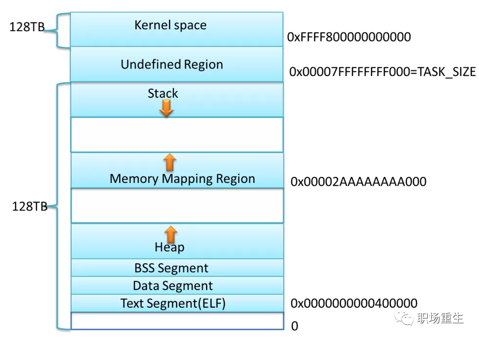
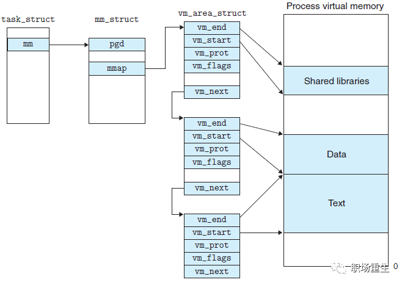
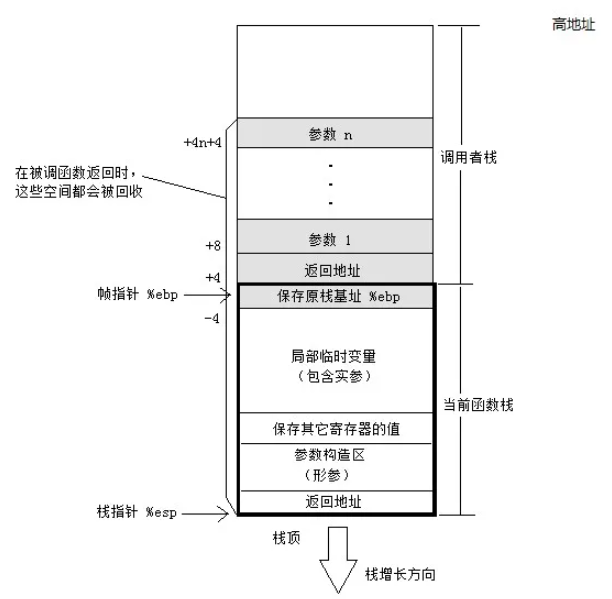
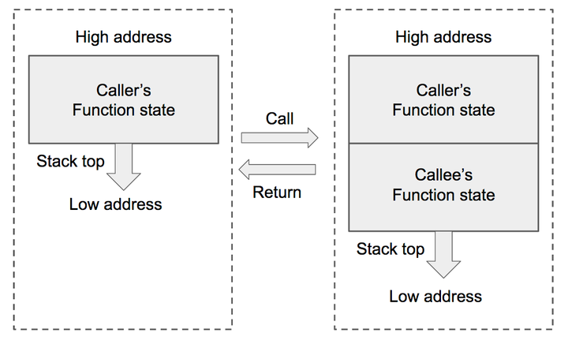
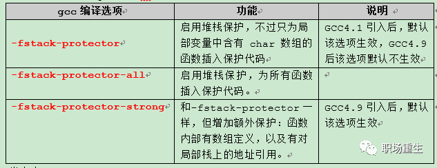

# C++ 内存模型

1. ## C++  程序运行内存空间模型

   32位：

   >下图为32位4GB内存空间，这些虚拟内存通过页表映射到实际的物理内存，它们被操作系统的内核维护并被处理器使用。每个进程都有自己的页表，一旦虚拟地址被使用，它们会被所有运行在机器上的软件所使用，包括内核自身。因此虚拟地址空间必须留一些给内核专用（Linux下3G~4G的空间），这并不意味之内核使用如此多的物理内存，而只是意味着内核使用该段地址来映射它所使用的物理内存，内核空间在页表中会被设定特权级标示，内核的代码和数据总是可以被寻址的，并且始终为处理终端或者系统调用做好准备，相反，用户模式的进程地址空间映射总是随着进程的切换而变化。
   >**注意蓝色区域表示映射到屋里内存的虚拟地址，白色区域表示没有映射的区域**

   

   >- **栈：**进程最上面的段是栈，用来保存**局部变量**和**函数参数**，一个经常被使用的栈的区域会被保存在`cpu cache`中，从而加快访问速度。**进程中的每个线程都有各自独立的栈**。通过压入足够多的数据可以用完所有`stack`可以映射的空间，这就会导致页错误，从而被`Linux`的`expand_stack()`函数所处理，它又会调用`acct_stack_growth()`来判断是否可以增加栈的大小，如果栈的大小低于`RLIMIT_STACK`的限制（通常是8MB），那么栈会增长，从而程序会继续运行而不会知道`linux`内部所为它做的努力。**这就是通常的根据要求调整栈大小的机制**。然而，如果达到了最大所允许的栈大小，就会导致栈溢出，从而引发一个程序的`segmentation fault`。当一个映射的栈区域根据需要而扩大了，它是不会随着栈变小而再缩减回来。动态的栈增长是唯一的一种合法的访问未被映射的内存区域的场景。**任何访问一个未被映射的内存的行为都会触发一个页错误**，从而导致`segmentation fault`。有一些映射区域是只读的，因此对它的写访问也会导致相同的`segmentation faults`。
   >- **memory mapping segment：**栈的下面就是`memory mapping segment`。这里被内核用来把文件内容直接映射到内存。所有的应用程序都可以使用`linux`提供的`mmap()`系统调用或者在`windows`中使用`CreateFileMapping()/MapViewOfFile`来进行这样的映射。`memory mapping`是进行文件`I/O`的高效方法，所以动态库的加载使用这个方式来实现。当然，也可以进行一些不关联到文件的程序数据的匿名`memory mapping`。**在`linux`中，如果你通过`malloc()`来申请一块大的内存，C库就会在`memory mapping segment`中创建一个匿名`memory mapping`而不是使用堆空间**。这里的“大”意味着大于`MMAP_THRESHOLD`字节，默认是128kb,可以通过`mallopt()`来进行调整。
   >- **堆： ** **堆提供了运行时的内存分配。**大多数的语言都提供了对堆进行管理的接口。因此满足内存请求就是一个程序的运行时环境和内核之间的接口的问题。在`C语言`中，这个接口就是`malloc`以及它的一些伙伴，而在有垃圾回收机制的语言如`C#`中的接口就是`new`关键字。如果有足够的堆空间来满足内存请求，它就可易被该语言的运行时环境所管理而不需要内核的干预。否则，堆通过内核提供的系统调用`brk()`来满足所请求的空间。堆的管理是复杂的，需要成熟的算法，它必须是满足速度和内存使用效率上的折衷。响应一个对堆内存的请求时间是跟具体的场景相关的。实时系统对于着疑问剃就有特殊的要求，所以产生了特殊的分配器。
   >- **BSS段：BSS中存放的是没有初始化的静态变量, 它的值没有被程序在代码中设置。**BSS内存区是匿名的，它不会映射到任何文件.
   >- **Data段**：**数据段保存的是在代码中被初始化了的变量。这个内存区不是匿名的**。它映射了程序二进制文件中包含的被初始化了的变量。所以，如果你在程序中写了`static int cntWorkerBees = 10`，那么该变量就会保存在数据段并且值为10。请注意，即使数据段会映射一个文件，它也是私有的内存映射，这意味着你更新了内存中的值也不会反应到它所映射的文件中。*这是必须的，因为如果你在运行程序中改变了全局变量的值，却要把这个值写到硬盘上，这是不可取的！*
   >- **Text Segment(代码段)：代码段**是只读的并且你所有的代码都会保存在那里。代码段也会映射到内存当中，但是如果你尝试往那个区域去写就会导致一个`Segmentation Fault`。

64位：

> 在64位系统里面，Linux会采用最低48位来表示虚拟内存，这可通过` /proc/cpuinfo `来查看`address sizes` :总的虚拟地址空间为256TB( 2^48 )，在这256TB的虚拟内存空间中, `0000000000000000 - 00007fffffffffff(128TB)`为用户空间，`ffff800000000000 - ffffffffffffffff(128TB)`为内核空间。

------

## 2. Linux 虚拟内存内部实现

#### 		1)  为了防止内存被攻击，比如栈溢出攻击和堆溢出攻击等，`Linux`在特定段之间使用随机偏移，使段的起始地址是随机值, `Linux` 系统上的`ASLR	 `等级可以通过文件` /proc/sys/kernel/randomize_va_space `来进行设置，它支持以下取值：

- 关闭的随机化。一切都是静止的。

- 保守的随机化。共享库、栈、`mmap()`、`VDSO`以及堆将被随机化。

- 完全的随机化。除了上面列举的要素外，通过 `brk() `分配得到的内存空间也将被随机化。

  

  #### 2)  Linux虚拟内存是按页分配，每页大小为4KB或者2M，1G等（大页内存）, 默认是4K

  #### 3)  通过`pmap `查看程序内存布局(综合`proc/x/maps`与`proc/x/smaps`数据）

  #### 4) 每个段都有特定的安全控制（权限）

|           |         |                                                              |
| --------- | ------- | ------------------------------------------------------------ |
| `vm_flags | 如 r-xp | 此段虚拟地址空间的属性。每种属性用一个字段表示，r表示可读，w表示可写，x表示可执行，p和s共用一个字段，互斥关系，p表示私有段，s表示共享段，如果没有相应权限，则用’-’代替 |

------

## 3. **C++栈内存空间模型**

##### 		1)  C++程序运行调用栈示意图：

> 函数调用过程中，栈（有俗称堆栈）的变化：函数调用栈是指程序运行时内存一段连续的区域，用来保存函数运行时的状态信息，包括函数参数与局部变量等。称之为“栈”是因为发生函数调用时，调用函数（`caller`）的状态被保存在栈内，被调用函数（`callee`）的状态被压入调用栈的栈顶；在函数调用结束时，栈顶的函数（`callee`）状态被弹出，栈顶恢复到调用函数（`caller`）的状态。函数调用栈在内存中从高地址向低地址生长，所以栈顶对应的内存地址在压栈时变小，退栈时变大。函数状态主要涉及三个寄存器－－`esp，ebp，eip`。`esp` 用来存储函数调用栈的栈顶地址，在压栈和退栈时发生变化。`ebp `用来存储当前函数状态的基地址，在函数运行时不变，可以用来索引确定函数参数或局部变量的位置。`eip` 用来存储即将执行的程序指令的地址，`cpu` 依照` eip `的存储内容读取指令并执行，`eip `随之指向相邻的下一条指令，如此反复，程序就得以连续执行指令。 [详情](https://zhuanlan.zhihu.com/p/25816426)

#### 	2) 栈攻击

> 由上面栈内存布局可以看出，**栈很容易被破坏和攻击**，通过栈缓冲器溢出攻击，用攻击代码首地址来替换函数帧的返回地址，当子函数返回时，便跳转到攻击代码处执行,获取系统的控制权，所以操作系统和编译器采用了一些常用的防攻击的方法：
>
> - **ASLR(地址空间布局随机化)**：操作系统可以将函数调用栈的起始地址设为随机化（这种技术被称为内存布局随机化，即Address Space Layout Randomization (ASLR) ），加大了查找函数地址及返回地址的难度。
>
> - **`Cannary` **: 开启`Canary`之后，函数开始时在`ebp`(栈顶位置)和临时变量之间插入一个随机值，函数结束时验证这个值。如果不相等（也就是这个值被其他值覆盖了），就会调用 `_stackchk_fail`函数，终止进程。对应GCC编译选项`-fno-stack-protector`解除该保护。
>
>   `gcc`关于栈溢出检测的几个参数：
>
> - **NX：**开启NX保护之后，程序的堆栈将会不可执行。对应GCC编译选项`-z execstack`解除该保护。

#### 	3）栈异常处理

> - 一个函数（或方法）抛出异常，那么它首先将当前栈上的变量**全部清空(unwinding)**，**如果变量是类对象的话，将调用其析构函数**，接着，异常来到**call** **stack**的上一层，做相同操作，直到遇到**catch语句**。
> - 指针是一个普通的变量，不是类对象，所以在清空**call stack**时，**指针指向资源的析构函数将不会调用**。

## 4. **C++堆内存空间模型**

#### 	1) C++ 程序动态申请内存`new/delete`：C++内置操作符

>- new操作符做两件事，分配内存+调用构造函数初始化。你不能改变它的行为；
>
>- delete操作符同样做两件事，调用析构函数+释放内存。你不能改变它的行为；

#### 	2) **operator new**

>1.是用来专门分配内存的函数，为new操作符调用，你能增加额外的参数重载函数operator new（有限制）: 
>
>- 限制1：第一个参数类型必须是size_t；    
>
>- 限制2：函数必须返回void*；
>
>2.operator new 底层一般调用malloc函数（gcc+glibc）分配内存；
>
>3.operator new 分配失败会抛异常（默认），通过传递参数也可以不抛异常，返回空指针；

#### 3) **operator delete**

>1.是用来专门分配内存的函数，为delete操作符调用，你能增加额外的参数重载函数operator delete（有限制）:
>
>-   限制1：第一个参数类型必须是void*；
>
>-   限制2：函数必须返回void；
>
>2.operator delete底层一般调用free函数（`gcc+glibc`）释放内存；
>
>3.operator delete分配失败会抛异常（默认），通过传递参数也可以不抛异常，返回空指针；

#### 4) **placement new/delete 函数**

>1. placement new 其实就是new的一种重载，placement new是一种特殊的operator new，作用于一块已分配但未处理或未初始化的raw内存，就是用一块已经分配好的内存上重建对象（调用构造函数）；
>2. 它是C++库标准的一部分；
>3. placement delete 什么都不做；
>4. 数组分配 new[]/delete[] 表达式
>   - 对应会调用operator new[]/delete[]函数;
>   - 按对象的个数，分别调用构造函数和析构函数；

#### 5) **定制对象特殊new/delete函数**

一般使用全局函数：

> ::operator new::operator delete

制定特殊函数的关键点：

>- 你想在堆上建立一个对象，应该用new操作符。它既分配内存又为对象调用构造函数。
>- 如果你仅仅想分配内存，就应该调用operator new函数；它不会调用构造函数。
>- 如果你想定制自己的在堆对象被建立时的内存分配过程，你应该写你自己的operator new函数，然后使用new操作符，new操作符会调用你定制的operator new.
>- 如果你想在一块已经获得指针的内存里建立一个对象，应该用placement new.
>- C++可以为分配失败设置自己的异常处理函数
>- 如果在构造函数时候抛出异常，new表达式后面会调用对应operator delete函数释放内存
