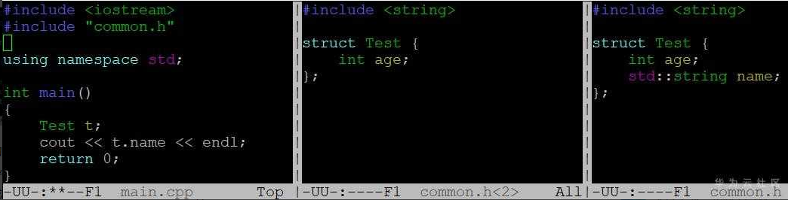
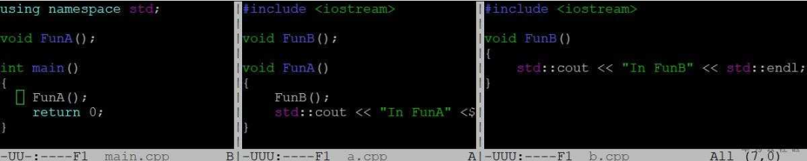
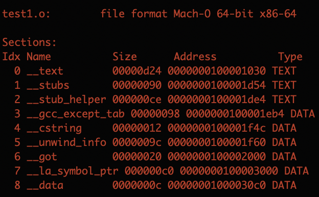
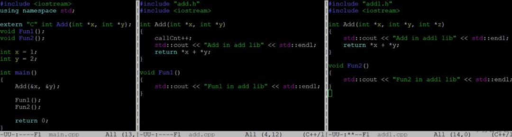
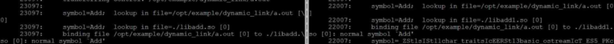
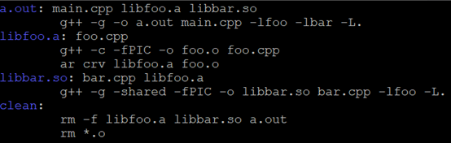

# C++ 程序链接

### 1、程序构建

> 程序构建大概需要经历四个过程：预处理、编译、汇编、链接
>
> - **预处理**：`g++ -E main.cpp -o main.ii`，-E表示只进行预处理。预处理主要是处理各种宏展开；添加行号和文件标识符，为编译器产生调试信息提供便利；删除注释；保留编译器用到的编译器指令等。
> - **编译**：`g++ -S main.ii –o main.s`，-S表示只编译。编译是在预处理文件基础上经过一系列词法分析、语法分析及优化后生成汇编代码。
> - **汇编**：`g++ -c main.s –o main.o`。汇编是将汇编代码转化为机器可以执行的指令。
> - **链接**：`g++ main.o`。链接生成可执行程序，之所以需要链接是因为我们代码不可能像main.cpp这么简单，现代软件动则成百上千万行，如果写在一个main.cpp既不利于分工合作，也无法维护，因此通常是由一堆cpp文件组成，编译器分别编译每个cpp，这些cpp里会引用别的模块中的函数或全局变量，在编译单个cpp的时候是没法知道它们的准确地址，因此在编译结束后，需要链接器将各种还没有准确地址的符号（函数、变量等）设置为正确的值，这样组装在一起就可以形成一个完整的可执行程序。


### 2、链接

1. **链接链的是什么**？

> 链接链的就是目标文件，什么是目标文件？目标文件就是源代码编译后但未进行链接的那些中间文件，如Linux下的`.o`，它和可执行文件的内容和结构很相似，格式几乎是一样的，可以看成是同一种类型的文件，Linux下统称为`ELF`文件，这里介绍下`ELF`文件标准：

- **可重定位文件**：Linux中的`.o`，这类文件包含**代码和数据**，可被**链接成可执行文件或共享目标文件**，例如静态链接库。

- **可执行文件**：可以直接执行的文件，如`/bin/bash`文件。

- **共享目标文件**：Linux中的`.so`，包含代码和数据，**一种**是链接器可以使用这种文件和其它的 <u>可重定位文件</u> 和 <u>共享目标文件</u> 链接，**另一种**是动态链接器可以将几个这种 <u>共享目标文件</u> 和 <u>可执行文件</u> 结合，作为进程映像的一部分来执行。

- **core dump文件**：进程意外终止时，系统可以将该进程的地址空间的内容和其它信息存到`coredump`文件用于调试，如`gdb`。

  

2. **目标文件的构成**

> 目标文件主要分为 <u>文件头、代码段、数据段和其它</u>。(可以通过命令`file`查看文件格式)
>
> ```c++
> file test.o
> ```
>
> - **文件头**：描述整个文件的文件属性（文件是否可执行、是静态链接还是动态链接、入口地址、目标硬件、目标操作系统等信息），还包括段表，用来描述文件中各个段的数组，描述文件中各个段在文件中的偏移位置和段属性。
> - **代码段**：程序源代码编译后的机器指令。
> - **数据段**：数据段分为`.data`段和`.bss`段。
>   - `.data`段内容：已经初始化的全局变量和局部静态变量
>   - `.bss`段只是为未初始化的全局变量和局部静态变量预留位置，本身没有内容，不占用空间。
> - 除了代码段和数据段，还有`.rodata`段、`.comment`、`字符串表`、`符号表`和`堆栈提示段`等等，还可以自定义段。

​	

​	1) ` .bss`段不占据空间，那它的大小和符号存在哪呢？

> `.bss`段占据的大小存放在`ELF`文件格式中的**段表(Section Table)**中，段表存放了各个段的各种信息，比如<u>段的名字</u>、<u>段的类型</u>、<u>段在elf文件中的偏移</u>、<u>段的大小</u>等信息。同时符号存放在符号表`.symtab`中。
>
> `.bss`不占据实际的磁盘空间，只在段表中记录大小，在符号表中记录符号。**当文件加载运行时，才分配空间以及初始化**。
>
> `ls -l test.o`可查看文件大小

​	

​	2) 可以使用一些工具查看ELF文件头以及各个段的内容：

> - `readelf -h test.o`: 可以使用`readelf`查看文件头：ELF魔数、文件机器字节长度、数据存储方式、版本、运行平台、ABI版本、ELF重定位类型、硬件平台、硬件平台版本、入口地址、程序头入口和长度、段表的位置和长度和段的数量。
> - `readelf -S test.o`: 可以查看所有段
> - `objdump -h test.o`: 查看段表的方法,使用objdump查看ELF文件中包含的关键的段


3. **程序为什么要分成数据段和代码段**?

> 1. 数据和指令被映射到两个虚拟内存区域，数据段对进程来说可读写，代码段是只读，这样可以防止程序的指令被有意无意的改写。
> 2. 有利于提高程序局部性，现代CPU缓存一般被设计成数据缓存和指令缓存分离，分开对CPU缓存命中率有好处。
> 3. 代码段是可以共享的，数据段是私有的，当运行多个程序的副本时，只需要保存一份代码段部分。


4. **链接器通过什么进行的链接**?

> **链接的接口是符号**，在链接中，将**函数和变量统称为符号**，函数名和变量名统称为符号名。
>
> 可以将符号看作是链接中的粘合剂，整个链接过程基于符号才可以正确完成，符号有很多类型，主要有**局部符号**和**外部符号**，<u>局部符号只在编译单元内部可见，对于链接过程没有作用</u>，<u>在目标文件中引用的全局符号，却没有在本目标文件中被定义的叫做外部符号</u>，以及定义在本目标文件中的可以被其它目标文件引用的全局符号，在链接过程中发挥重要作用。

可以使用一些命令查看符号信息：

- <font color='purple'>command `nm`</font>

  ```c++
  $ nm test.o
  0000000100000000 T __mh_execute_header
  0000000100000fb0 T _main
                   U dyld_stub_binder
  ```

- <font color='purple'>command `readelf`</font>

  ```c++
  $ readelf -s test.o
  Symbol table '.symtab' contains 12 entries:
  Num:    Value          Size Type    Bind   Vis      Ndx Name
      0: 0000000000000000     0 NOTYPE  LOCAL  DEFAULT  UND
      1: 0000000000000000     0 FILE    LOCAL  DEFAULT  ABS test_c.cc
      2: 0000000000000000     0 SECTION LOCAL  DEFAULT    1
      3: 0000000000000000     0 SECTION LOCAL  DEFAULT    3
      4: 0000000000000000     0 SECTION LOCAL  DEFAULT    4
      5: 0000000000000000     0 SECTION LOCAL  DEFAULT    5
      6: 0000000000000000     0 SECTION LOCAL  DEFAULT    7
      7: 0000000000000000     0 SECTION LOCAL  DEFAULT    8
      8: 0000000000000000     0 SECTION LOCAL  DEFAULT    6
      9: 0000000000000000    23 FUNC    GLOBAL DEFAULT    1 main
     10: 0000000000000000     0 NOTYPE  GLOBAL DEFAULT  UND _GLOBAL_OFFSET_TABLE_
     11: 0000000000000000     0 NOTYPE  GLOBAL DEFAULT  UND puts
  ```

- <font color='purple'>command `objdump`</font>

  ```c++
  $ objdump -t test.o
  test.o:     file format elf64-x86-64
  
  SYMBOL TABLE:
  0000000000000000 l    df *ABS*  0000000000000000 test_c.cc
  0000000000000000 l    d .text  0000000000000000 .text
  0000000000000000 l    d .data  0000000000000000 .data
  0000000000000000 l    d .bss   0000000000000000 .bss
  0000000000000000 l    d .rodata        0000000000000000 .rodata
  0000000000000000 l    d .note.GNU-stack        0000000000000000 .note.GNU-stack
  0000000000000000 l    d .eh_frame      0000000000000000 .eh_frame
  0000000000000000 l    d .comment       0000000000000000 .comment
  0000000000000000 g     F .text  0000000000000017 main
  0000000000000000         *UND*  0000000000000000 _GLOBAL_OFFSET_TABLE_
  0000000000000000         *UND*  0000000000000000 puts
  ```

  

### 3. 一些tips

1. **为什么需要`extern "C"`**?

> C语言函数和变量的符号名基本就是函数名字变量名字，**不同模块如果有相同的函数或变量名字就会产生符号冲突无法链接成功的问题**。
>
> C++引入了命名空间来**解决这种符号冲突问题**。同时为了支持函数重载C++也会根据函数名字以及命名空间以及参数类型生成特殊的符号名称。
>
> `extern "C"`:**由于C语言和C++的符号修饰方式不同**，C语言和C++的目标文件在链接时可能会报错说找不到符号，所以为了C++和C兼容，引入了extern "C"，当<u>引用某个C语言的函数时加extern "C"告诉编译器对此函数使用C语言的方式来链接，如果C++的函数用extern "C"声明，则此函数的符号就是按C语言方式生成的。</u>

以`memset`函数举例，C语言中以C语言方式来链接，但是在C++中以C++方式来链接就会找不到这个`memset`的符号，所以需要使用`extern "C"`方式来声明这个函数，为了兼容C和C++，可以使用宏来判断，用条件宏判断当前是不是C++代码，如果是C++代码则`extern "C"`。

```c
#ifdef __cplusplus
extern "C" {
#endif

void *memset(void *, int, size_t);

#ifdef __cplusplus
}
#endif
```


2. **强弱符号**

> **在C语言中：**
>
> 强符号：有初始化的就是强符号
> 弱符号：未初始化的就是弱符号
>
> 1.如果在一个工程中出现同名的强符号，编译一定出错
>
> ```c++
> duplicate symbol '_i' in:
>     /var/folders/cx/mx43gvzj60z3_c9pgfk9hhxh0000gn/T/Hello-799d8f.o
>     /var/folders/cx/mx43gvzj60z3_c9pgfk9hhxh0000gn/T/test1-ae0927.o
> ld: 1 duplicate symbol for architecture x86_64
> ```
>
> 2.如果出现同名的一个强符号一个弱符号，则不会报错，且使用的时候优先使用强符号
> 3.一个符号在所有目标文件中都是弱符号，选择占用空间最大的符号，int类型和double类型选double类型

<font color='purple'>__attribute__((weak))</font>可以定义弱符号

```c
extern int ext;

int weak; // 弱符号
int strong = 1; // 强符号
__attribute__((weak)) int weak2 = 2; // 弱符号

int main() {
   return 0;
}
```


3. **强引用和弱引用**

> 一般引用了某个函数符号，而这个函数在任何地方都没有被定义，则会报错`error: undefined reference to 'xxx'`，**这种符号引用称为强引用**。
>
> 与此对应的则有弱引用，链接器对强引用弱引用的处理过程几乎一样，**只是对于未定义的弱引用，链接器不会报错**，而是默认其是一个特殊的值。

```c++
__attribute__ ((weak)) void foo();

int main() {
   foo();
   return 0;
}
```

`g++ test.cpp -o test.o`以上程序编译链接时不会出错，但是在运行时会报错。

> 这种强引用弱引用对于库来说十分有用，库中的弱引用可以被用户定义的强引用所覆盖，这样程序就可以使用自定义版本的库函数，可以将引用定义为弱引用，如果去掉了某个功能，也可以正常连接接，想增加相应功能还可以直接增加强引用，方便程序的裁剪和组合。


### 4. 四个问题透析Linux下C++编译&链接

1. **问题一：头文件遮挡**

在编译过程中最诡异的问题莫过于头文件遮挡，如下代码中main.cpp包含头文件common.h，真正想用的头文件是图中最右边那个包含name



成员的文件（所在目录为./include），但在编译过程中中间的common.h（所在目录为./include1）抢先被发现，导致编译器报错：Test结构没有name成员，对程序员来讲，自己明明定义了name成员，居然说没有name这个成员，如果第一次碰到这种情况可能会怀疑人生。应对这种诡异的问题，<font color='purple'>**我们可以用-E参数看下编译器预处理后的输出**</font>。从展开后的输出我们可以清楚地看到Test结构确实没有定义name这个成员，并且Test这个结构是在./include1中的common.h中定义的，到此真相大白，编译器压根就没用我们定义的Test结构，而是被别的同名头文件截胡了。我们可以通过调整-I或者在头文件中带上部分路径更详细制定头文件位置来解决。

> 预处理文件格式如下：`# linenum filename flag`，表示之后的内容是从文件名为filaname的文件中第linenum行展开的，flag的取值可以是1,2,3,4，可以是用空格分开的多值
>
> 1表示接下来要展开一个新文件；
>
> 2表示一个文件展开完毕；
>
> 3表示接下来内容来自一个系统头文件；
>
> 4表示接下来的内容应该看做是`extern C`形式引入的。


<font color='purple'>☆ **静态链接过程：**</font>

>1. 链接器从左到右按照命令行出现顺序扫描目标文件和静态库
>2. 链接器<font color='purple'>维护一个目标文件的集合E，一个未解析符号集合U，以及E中已定义的符号集合D，初始状态E、U、D都为空</font>
>3. 对命令行上每个文件f，链接器会判断f是否是一个**目标文件**还是静态库，如果是**目标文件**，则f加入到E，f中未定义的符号加入到U中，已定义符号加入到D中，继续下一文件
>4. 如果是**静态库**，链接器尝试到静态库目标文件中匹配U中未定义的符号，如果m中匹配U中的一个符号，那么m就和上步中文件f一样处理，对每个成员文件都依次处理，直到U、D无变化，不包含在E中的成员文件简单丢弃
>5. 所有输入文件处理完后，如果U中还有符号，则出错，否则链接正常，输出可执行文件


2. **问题二：静态库顺序**

如下图所示，`main.cpp ` 依赖 `liba.a`，`liba.a`又依赖`libb.a`，根据静态链接算法，如果用`g++ main.cpp liba.a libb.a`的顺序能正常链接，因为解析`liba.a`时未定义符号`FunB`会加入到上述算法的U中，然后在`libb.a`中找到定义，如果用`g++ main.cpp libb.a liba.a`的顺序编译，则无法找到`FunB`的定义，因为根据静态链接算法，在解析`libb.a`的时候U为空，所以不需要做任何解析，简单抛弃`libb.a`，但在解析`liba.a`的时候又发现`FunB`没有定义，导致U最终不为空，链接错误，因此在做静态链接时，需要特别注意库的顺序安排，引用别的库的静态库需要放在前面，碰到链接很多库的时候，可能需要做一些库的调整，从而使依赖关系更清晰。




> **静态链接**有很多不足：
>
> - 不利于更新，只要有一个库有变动，都需要重新编译；
> - 不利于共享，每个可执行程序都单独保留一份，对内存和磁盘是极大的浪费。
>
> **动态链接**的出现解决了这一问题。

<font color='purple'>**☆动态链接：**</font>

​	1）**怎么生成动态链接**

> 生成动态链接库需要用到参数`“-shared -fPIC”`表示要生成位置无关代码PIC（Position Independent Code）的**共享目标文件**。
>
> ```c++
> $ g++ test_a.cpp test_b.cpp -fPIC -shared -o libtest.so
> ```

​	

------

​	2）**动态链接的原理**

> 对于**静态链接**，<font color='purple'><u>在生成可执行目标文件时整个链接过程就完成了</u></font>，但要想实现动态链接的效果，<font color='purple'><u>就需要把程序按照模块拆分成相对独立的部分，在程序运行时将他们链接成一个完整的程序</u></font>，同时为了实现代码在不同程序间共享要保证代码是和位置无关的（因为共享目标文件在每个程序中被加载的虚拟地址都不一样，要保证它不管被加载在哪都能工作），而为了实现位置无关又依赖一个前提：<font color='purple'>**数据段和代码段的距离总是保持不变**</font>。
>
> ```c++
> # 动态库的链接 libhello.so
> $ g++ test1.cpp -L ./ -l hello -o test1.o
>   
> # -L./lib 将后面的目录加入g++链接库的搜索路径， -lhello 将后面的目录加入g++头文件的搜索路径 
> # 如果不写-L只写-lhello时，会出现"无法找到-lhello"等类似错误
> ```
>
> 
>
> 由于不管在内存中如何加载一个目标模块，数据段和代码段间的距离是不变的，编译器在数据段前面引入了一个<font color='purple'>全局偏移表GOT（Global Offset Table）</font>，被引用的全局变量或者函数在GOT中都有一条记录，同时编译器为GOT中每个条目生成一个重定位记录，因为数据段是可以修改的，动态链接器在加载时会重定位GOT中的每个条目，这样就实现了PIC。
>
> 

大体原理基本就这样，但具体实现时，对函数的处理和全局变量有所不同。由于大型程序函数成千上万，而程序很可能只会用到其中的一小部分，因此没必要加载的时候把所有的函数都做重定位，只有在用到的时候才对地址做修订，为此编译器引入了过程链接表<font color='purple'>PLT（Procedure Linkage Table）</font>来实现延时绑定。**PLT在代码段中，它指向了GOT中函数对应的地址**，第一次调用时候，GOT存放的不是函数的实际地址，而是PLT跳转到GOT代码的后一条指令地址，这样第一次通过PLT跳转到GOT，然后通过GOT又调回到PLT的下一条指令，相当于什么也没做，**紧接着PLT后面的代码会将动态链接需要的参数入栈**，然后调用<font color='purple'>动态链接器</font>修正GOT中的地址，从这以后，PLT中代码跳转到GOT的地址就是函数真正的地址，从而实现了所谓的延时绑定。

| Section 名称      | 说明                                                      |
| ----------------- | --------------------------------------------------------- |
| .interp           | 指明了动态链接器位置（objdump -s a.out\|redelf -l a.out） |
| .dynamic          | 类似静态链接中section头部（readelf -d XX.so）             |
| .dynsym           | 动态符号的导入导出关系（readelf -sD XX.so）               |
| .rel.dyn/.rel.plt | 全局变量和函数的重定位表（readelf -r XX.so）              |


------

​	3）**动态链接的过程**

> 1 装载过程中程序执行会跳转到<font color='purple'>动态链接器</font>

> 2 <font color='purple'>动态链接器</font>通过GOT、.dynamic信息完成自身的重定位工作

> 3 装载共享目标文件：将可执行文件和链接器本身符号合并入全局符号表，依次**广度优先遍历共享目标文件**，它们的符号表会不断合并到全局符号表中，<u>如果多个共享对象有相同的符号，则优先载入的共享目标文件会屏蔽掉后面的符号</u>

> 4 重定位和初始化


3. **问题三：全局符号介入**

动态链接过程中最关键的第3步可以看到，当多个共享目标文件中包含一个相同的符号，那么会导致先被加载的符号占住全局符号表，后续共享目标文件中相同符号被忽略。当我们代码中没有很好的处理命名的话，会导致非常奇怪的错误，幸运的话立刻`core dump`，不幸的话直到程序运行很久以后才莫名其妙的`core dump`，甚至永远不会`core dump`但是结果不正确。

> <font color='purple'>**core dump:**</font> 当程序运行的过程中异常终止或崩溃，操作系统会将程序当时的内存状态记录下来，保存在一个文件中，这种行为就叫做`Core Dump`（中文有的翻译成“核心转储”)。我们可以认为` core dump `是“内存快照”，但实际上，除了内存信息之外，还有些关键的程序运行状态也会同时 dump 下来，例如寄存器信息（包括程序指针、栈指针等）、内存管理信息、其他处理器和操作系统状态和信息。`core dump `对于编程人员诊断和调试程序是非常有帮助的，因为对于有些程序错误是很难重现的，例如指针异常，而 `core dump` 文件可以再现程序出错时的情景。
>
> <font color='purple'>**相关设置：**</font>如果没有进行`core dump` 的相关设置，默认是不开启的。可以通过`ulimit -c`查看是否开启。如果输出为`0`，则没有开启，需要执行`ulimit -c unlimited`开启`core dump`功能。
>
> ```
> ulimit相关选项如下：
> -a：显示目前资源限制的设定；
> -c <core文件上限>：设定core文件的最大值，单位为区块；
> -d <数据节区大小>：程序数据节区的最大值，单位为KB；
> -f <文件大小>：shell所能建立的最大文件，单位为区块；
> -H：设定资源的硬性限制，也就是管理员所设下的限制；
> -m <内存大小>：指定可使用内存的上限，单位为KB；
> -n <文件数目>：指定同一时间最多可开启的文件数；
> -p <缓冲区大小>：指定管道缓冲区的大小，单位512字节；
> -s <堆叠大小>：指定堆叠的上限，单位为KB；
> -S：设定资源的弹性限制；
> -t <CPU时间>：指定CPU使用时间的上限，单位为秒；
> -u <程序数目>：用户最多可开启的程序数目；
> -v <虚拟内存大小>：指定可使用的虚拟内存上限，单位为KB。
> ```
>
> 使用 gcc 编译源文件，加上 -g 以增加调试信息；执行会产生错误，生成core文件。[参照文章](https://www.cnblogs.com/s-lisheng/p/11278193.html)



main.cpp中会用到两个动态库`libadd.so`，`libadd1.so`的符号，当我们以`g++ main.cpp libadd.so libadd1.so`编译时，程序输出“Add in add lib”说明Add是用的`libadd.so`中的符号（add.cpp），当我们以`g++ main.cpp libadd1.so libadd.so`编译时，程序输出“Add in add1 lib”说明Add是用的`libadd1.so`中的符号。<font color='purple'>这时候问题就大了，调用方main.cpp中认为Add只有两个参数，而add1.cpp中认为Add有三个参数，程序中如果有这样的代码，可以预见很可能造成巨大的混乱。</font>

> 具体符号解析我们可以通过`LD_DEBUG=all ./a.out`来观察Add的解析过程，如下图所示：左边是对应`libadd.so`在编译时放在前面的情况，Add绑定在`libadd.so`中，右边对应`libadd1.so`放前面的情况，Add绑定在`libadd1.so`中。



> <font color='purple'>`LD_DEBUG`:</font>*一个稍微有经验的**Linux**程序员都知道使用* *LD_LIBRARY_PATH* 来临时设置加载器搜索动态链接库so的路径顺序。但另一个不为人知的环境变量是`LD_DEBUG`。这个变量可以提供非常详细的加载动态链接库的信息。
>
> export LD_DEBUG=files   # 显示库的依赖性和加载的顺序
>
> export LD_DEBUG=bindings  # 符号绑定
>
> export LD_DEBUG=libs  # 显示加载器查找库时使用的路径的顺序
>
> export LD_DEBUG=versions  # 版本依赖性
>
> export LD_DEBUG=help  # LD_DEBUG的帮助信息


​	1）运行时加载动态库

> 有了动态链接和共享目标文件的加持，Linux提供了一种更加灵活的模块加载方式：通过提供dlopen，dlsym，dlclose，dlerror几个API，可以实现在运行的时候动态加载模块，从而实现插件的功能。


4. **问题四：静态全局变量与动态库导致double free**

在全面了解了动态链接相关知识后，来看一个静态全局变量和动态库纠结在一起引发的问题，代码如下，foo.cpp中有一个静态全局对象foo_，foo.cpp会编译成一个libfoo.a，bar.cpp依赖libfoo.a库，它本身会编译成libbar.so，main.cpp既依赖于libfoo.a又依赖libbar.so。makefile如下



运行a.out会导致double free的错误。这是由于在一个位置上调用了两次析构函数造成的。之所以会这样是因为链接的时候先链接的静态库，将foo_的符号解析为静态库中的全局变量，当动态链接libbar.so时，由于全局已经有符号foo_，因此根据全局符号介入，动态库中对foo_的引用会指向静态库中版本，导致最后在同一个对象上析构了两次。

> **解决方法：**
>
> 1. 不使用全局对象
>
> 2. 编译时候调换库的顺序，动态库放在前面，这样全局只会有一个foo_对象
>
> 3. 全部使用动态库
>
> 4. 通过编译器参数来控制符号的可见性。

