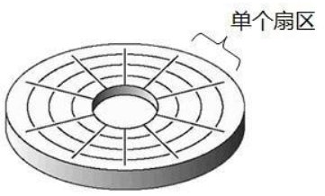

# Linux 文件系统

------

## 1.什么 文件系统 —— 【Linux中一切皆文件】

- **文件系统** 是操作系统中负责管理持久数据的子系统，即将用户的文件存到硬盘硬件中，即使计算机断电了硬盘数据也也不会丢失。
- **文件系统**的基本数据单位是文件，将磁盘中的文件进行组织管理，组织的方式不同就会形成不同的**文件系统**。
- [**一切皆文件**]：块设备、管道和 socket 都是统一交给文件系统管理。

## 2. Linux 文件系统

Linux 文件系统会为每个文件分配两个数据结构——**索引节点**和**项目项**

- **索引节点（*index node*，iNode）**：用来记录文件的元信息，比如 *iNode 的编号*、*文件大小*、*访问权限*、*创建时间*、*修改时间、数据在磁盘的位置*等。索引节点是文件的 <u>唯一标识</u>，它们之间一 一对应，都会被<u>**存储在硬盘**</u>中，因此 **索引节点**同样占用 <u>**磁盘空间**</u>。
- **目录项（*directory entry*，dentry）**：用来记录 *文件的名字、索引节点指针以及与其他目录项的层级关联关系* 。多个目录项关联起来，就会形成目录结构，但它与索引节点不同的是 **<u>目录项是由内核维护的一个数据结构</u>**，不存放于磁盘，而是存在内存。

## 3. 磁盘

- **磁盘的组成：盘片，机械手臂，磁头，主轴马达**

  

  - **盘片**：同于存储数据，每个盘片有两面，第一个磁盘正面为 “0” 面，反面为 “1” 面，第二个盘片的正面为 “2” 面，依次类推。

  - **主轴**：所有盘片都围绕主轴转动

  - **机械手臂**：每个机械臂上有多个磁臂，每一个磁臂都有一个磁头

  - **磁头**：负责读写数据

    

- #### **盘面正视图**：扇区、柱面、起始柱面、结束磁柱、磁道

  

  

  - **磁道**：每个盘片可以划分为多个磁道，最外圈的磁道是 “0” 号磁道，向圆心依次递增为 1 磁道、2 磁道等等，磁盘的数据存放是从最外圈开始的。

    

  - **扇区**：把磁道划分为若干个弧段，每个弧段就是一个 **扇区（sector）**，扇区是硬盘上储存的物理单位，**每个扇区可以存储 512 字节**。<u>即使计算机只需要某一个字节的数据，也需要把这个 512 字节的数据全部读入内存，再选择所需要的那个字节</u>。

    

  - **柱面**：这是一个抽象的逻辑概念，处于同一个垂直区域的磁道就是 **柱面**，即各个盘面上相同位置磁道的集合。需要注意的是，磁盘读写数据是按照 **柱面** 进行的，磁头读写数据时首先在同一柱面内从 “0” 磁头开始进行操作，依次向下在同一柱面的不同盘片即磁头上进行操作，只有在同一柱面的所有磁头全部读写完毕后，磁头才能转移到下一柱面。因为磁头的选择只需要电子切换，而柱面的选择必须机械切换。<u>数据的读写是按柱面进行的，而不是按盘面进行</u>。

    

  #### Tips： 磁盘被磁盘控制器所控制。现代磁盘寻道采用 CHS（Cylinder Head Sector）的方式，磁盘读取数据时，磁盘读取数据时，读写磁头沿径向移动，移到要读取的扇区所在磁道的上方，这段时间称为寻道时间(seek time)。磁头到达指定磁道后，然后通过盘片的旋转，使得要读取的扇区转到读写磁头的下方，这段时间称为旋转延迟时间(rotational latency time)。然后再读写数据，读写数据也需要时间，这段时间称为传输时间（transfer time）。

  

- #### 磁盘的第一个扇区特别重要，它记录了整块磁盘的重要信息

  - **主引导分区（Master Boot Record，MBR）**：可以安装引导加载程序的地方，有 **446 bytes**，开机后系统会自动取

  - **分区表（partition table）**：记录整块硬盘分区的状态，有 **64 bytes**，这64 bytes总共分为四组记录区，每组记录了该区段的 **起始** 与 **结束** 柱面的号码。"分区“只针对64 bytes的分区表进行设置，分区的最小单位为柱面。

    

    如果上图硬盘设备的文件名为 “dev/hda" ，那么这四个分区在 Linux 系统中的设备文件名为：

    - P1：/dev/hda1
    - P2：/dev/hda2
    - P3：/dev/hda3
    - P4：/dev/hda4

#### 

