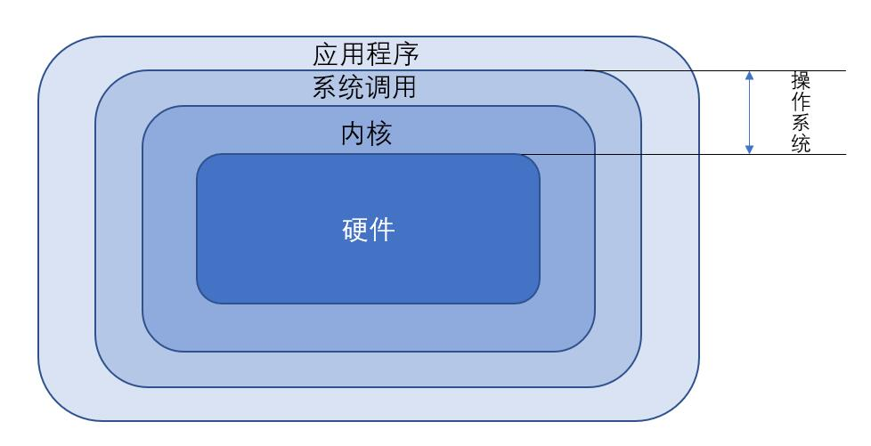

## Linux 操作系统

------

#### 1.  软件程序的运行：机器程序与编译程序 《= 操作系统 《= 应用程序



​	(1) 操作系统：包括操作系统内核（也是一组程序，重点管理计算机的所有活动以及驱动系统的所有硬件）

​	(2) 系统调用：硬件都由内核管理，如果想要开发软件，就参考这个内核的相关功能，如此，从原本参考硬件函数变成了参考内核功能。

​	(3) 内核功能：

- 系统调用接口
- 程序管理
- 内存管理
- 文件系统管理
- 设备驱动

   (4) 操作系统与驱动程序：安装驱动程序后，操作系统可以通过这个接口驱动这个硬件。


#### 2.Linux

1) 首先在 386 上实现多任务测试

​	(1) 编译程序需要什么

- 更够进行工作的环境 —— GNU 项目提供了 **bash** 工作环境

- 可以将源码编译成为可执行文件的编译程序 —— **gcc** 编译程序

​    (2) 如何兼容 UNIX

- 修改 Linux 让其符合 UNIX 软件能够在 Linux 上执行，参考 POSIX 标准（可携式操作系统接口，规范内核与应用程序之间的接口）

2）Linux内核版本

```
2.6.18-92.e15
主版本.次版本.释出版本-修改版本
```


